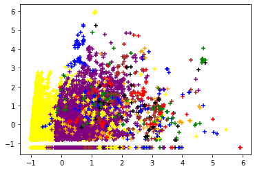

<h1 align="center">Data Mining</h1>

## 📝 **Algorithms:**
- **Density Based Spatial Clustering with Noise (DBSCAN)** can be used to find associations and structures in data to find patterns and predict trends. For example, it can be used in E-commerce to find clusters based on the products that the users have bought, and it can helps us find similarities between customers.

  

    - [Figure] DBSCAN algorithm groups together points that are close to each other based on Euclidean distance and minimum number of points. The points that are in low-density regions are considered outliers. 

- **Frequent Item Search** efficient for mining large item sets from user transactions collected in E-commerce. By using this approach, companies can provide online customers with useful information about products such as price and quality of goods.

### 🛠️ **Libraries:**
- Preprocessing: pandas, numpy, and scikit-learn
- Visualization: matplotlib and seaborn
- DBSCAN algorithm: NearestNeighbors
- Frequent Item Search: Efficient Apriori

## 💰 **Business Values:**
- E-commerce